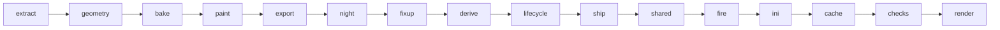

# The art engine: a map

`sagekit` builds new building art for BFME2 / RotWK from the player's own install. `assets/`
holds only recipes (Python classes and notes); everything built goes to `build/assets/`, which git
ignores. This page is the map: what exists, where it lives, how the pieces connect and where each
faction stands. The rules and each standard in detail: [assets/README.md](../assets/README.md).
What comes next: [FACTIONS-PLAN.md](FACTIONS-PLAN.md).

## Where each faction stands

| Faction | Recipes | State |
|---|---|---|
| Dwarves | 35 | Installed; every model the game draws carries the redesign: healthy, construction, damaged, really damaged, rubble, placement cursor, night. Not yet checked in game. |
| Elves | 23 | Installed. Not yet checked in game. [`assets/elves/ROLLOUT.md`](../assets/elves/ROLLOUT.md). |
| Men of the West (and Arnor) | 44 | Installed: citadel, upgrades, expansions, walls, production with level-ups, towers and specials. Not yet checked in game. [`assets/men/ROLLOUT.md`](../assets/men/ROLLOUT.md). |
| Goblins | 14 | Installed: palette E "Blood, iron and bone", every building. Not yet checked in game. [`assets/goblins/ROLLOUT.md`](../assets/goblins/ROLLOUT.md). |
| Isengard | 25 | Measured stubs; palette A with silver (Max's pick); the citadel built in colour (three lozenge blades round EA's tower, fire and embers, war-works on the walks); nothing installed. [`assets/isengard/ROLLOUT.md`](../assets/isengard/ROLLOUT.md). |
| Mordor | 25 | Palette F2 (Max's pick); the citadel in pass 7 (spike claws inside the crowns round green witch-fire), built in colour, not installed. [`assets/mordor/ROLLOUT.md`](../assets/mordor/ROLLOUT.md). |
| Angmar | 24 | Measured stubs; the mill and forge works (skinned bodies, [below](#a-skinned-body-the-angmar-mill-and-forge-works)) designed and staged; the citadel designed (pass 4: four frozen iron tines of the Witch-king's crown round a cold fire, ice at the feet), built in palette A2 (Max's pick: A with D's wood); nothing installed. [`assets/angmar/ROLLOUT.md`](../assets/angmar/ROLLOUT.md). |
| Neutral (capturable) | 11 | A pseudo-faction for EA's capturable buildings and creep lairs (`neutral` in `sagekit/taxonomy.py`): "Wilderland", EA's colours graded. Inn, signal fire, outpost and shipwright built with a capture dress per faction; ruined tower and the six lairs base design only; nothing installed. [`assets/neutral/ROLLOUT.md`](../assets/neutral/ROLLOUT.md). |
| Map scenery | 0 (sheets only) | EA's civilian buildings, ruins and set pieces (`scenery` in `sagekit/taxonomy.py`): each culture's sheets recoloured in its faction's palette or the Wilderland grade, geometry EA's. Staged, not installed. [Map scenery](#map-scenery-civilian-buildings-and-set-pieces), [`assets/scenery/ROLLOUT.md`](../assets/scenery/ROLLOUT.md). |

Budget: 512 MB of own textures per faction (`budget_mb` in `sagekit/style.py`; `sagekit budget`).
An installed faction adds `!!!!!!!!!!!sagekit-<faction>.big` with edited INIs to the game folder,
so everyone in a LAN game needs the same packs ([MULTIPLAYER.md](../MULTIPLAYER.md)).

## One building, step by step

`python3 -m sagekit build <faction>/<building>` runs these steps (`sagekit/pipeline.py`). Host
steps are plain Python; Blender steps run through `sagekit/blender/run.py`, at most
`SAGEKIT_BLENDER_SLOTS` (4) at once, and wait while the game runs.



| Step | Where | What it does |
|---|---|---|
| extract | host | EA's model, sheets and skeleton from the pristine archives; own copy renamed; `measure.json`; derived and lifecycle plans |
| geometry | Blender | the recipe's `design(kit)` solids added to EA's target mesh; cloth faces out to the house step; own UV layout |
| bake | Blender | G-buffers (position, normal, AO, masks, alpha) into our layout |
| paint | host (numpy) | the style's paint stack writes our diffuse, normal map and state variants (`_D`, `_Snow`, `_U`) |
| export | Blender | W3D export (the add-on drops things; fixup restores them) |
| night | Blender | the recipe's `night_lights` cast onto our finished body |
| fixup | host | materials, versions, pivots, collision trees restored; night meshes written under EA's names |
| derive | host | lifecycle models whose body is EA's healthy one get ours spliced in whole |
| lifecycle | Blender | the rest (construction, really damaged, rubble) rebuilt along EA's pieces, bones and animations |
| ship | host | exactly what goes into the game, at archive paths, in `out/` |
| shared | host | faction copies of other factions' sheets renamed, recoloured and shipped |
| fire | host | the recipe's `fire_points` as bones of a meshless rig model, `<model>_FX.w3d` |
| ini | host | texture swaps, repointed Draws, LOD off, house draws, hidden banners, fire Draws |
| cache | host | asset.dat records for every new or changed model and texture |
| checks | Blender | the check suite against EA's original: format, bones, footprint, height, UVs, sky-facing backs, alpha, night, lifecycle |
| render | Blender | `renders/compare_*.png` (EA against ours), `night/`, `lifecycle/` |
| *preview* | Blender | not a build step: `sagekit preview` runs extract (once), the geometry job into `preview/`, EEVEE renders in flat atlas-tag colours (`preview/compare_*.png`) and the bake-free checks (budget, footprint, height, winding, sky-facing backs, closed solids) in 10-20 s, for design iterations |

Faction-wide steps: `sagekit sheets <faction>` recolours the faction's own sheets (models we don't
redesign still match); `sagekit house <faction>` builds the player-colour models from every
building's cloth; `sagekit install` / `revert` put everything in the game and take it out.

## The standards every faction inherits

| Standard | Recipe says | Faction style says | Engine (under `sagekit/`) |
|---|---|---|---|
| One palette | nothing | ramps, materials, paint stack | `style.py`, `paint/` |
| Player colour | `house_tags` (which atlas tags are cloth) | `house_template` | `house.py`, `housemesh.py`, `blender/house.py` |
| Night lights | `night_lights(kit)` | `night = NightLook(...)` | `nightlights.py`, `blender/nightlights.py`, `paint/night.py`, `formats/w3dlight.py` |
| Fire | `fire_points = [(x, y, z, kind)]` | nothing | `fire.py`, `fire_systems.py`, `fire_checks.py` |
| Lifecycle | `lifecycle = {model: settings}` (rarely) | nothing | `lifecycle.py`, `blender/lifecycle*.py`, `formats/w3dpose.py`, `w3dmesh.py` |
| Own copies | `own_model`, `own_textures` | `shared_sheets` | `owncopy.py`, `sharedsheets.py`, `ownership.py` |
| Names | nothing | nothing | `names.py` (`assets/<faction>/NAMES.md`), `validate` |
| Cut-out alpha | nothing | nothing | `alpha.py`, `blender/alpha.py` |
| Capture dress | `Capturable`: `body(kit)`, `dress(kit)` | the factions' ramps (`DRESS_RAMPS`) | `capture.py`, `blender/capture.py` |

## Fire: the game's own particles

Painted flames read as plastic; the game's particle systems flicker, glow additively and read at
night. What EA's files and RotWK's `game.dat` show:

- `ParticleSysBone = <bone> <system> [FollowBone:Yes]` (the `=` is optional) in a
  ModelConditionState starts `<system>` at `<bone>` of that state's own model. There is no offset:
  the bone must be a pivot of the Draw's model. A bone the model lacks, `NONE`, or a state whose
  Model is None puts the system at the object's origin (EA's rubble smoke uses `NONE` on purpose).
  Pivot names hold 15 characters: EA's hearth names `dwarfHearth_SPARKS`, its model has
  `DWARFHEARTH_SPA`, so those sparks start at the origin.
- Every ModelConditionState starts as a copy of the Draw's DefaultModelConditionState, particle
  lines included (`game.dat` 0x4c8133; EA's comment in `neutralunits.ini`: "Not
  DefaultConditionState, because that keyword copies anything in here to every other state").
  EA's working forges put their fire in the default and keep the bones in every state's model
  (the Men forge's rubble still has `CHIMNEY`, `EMBERBONE`); the Isengard siege works' construction
  and damaged models carry `BN_FIRE05/06`, its really damaged and rubble ones do not.
- Damage fire is per state on bones of the state's model (`FIRESMALL01..05` in `_D1`/`_D2`,
  `SMOKELARGE01` in `_D3`); effects that must not spread use a Draw of their own with no default
  and `ModelConditionState = NONE` first (the Dwarven hearth's and statue's `TheHealEffect`).

So sagekit's fire never touches EA's Draws, models or animations (their hierarchy stays byte for
byte, animations keep their pivot indices). A recipe's `fire_points` become one rig per building,
`<model>_FX.w3d`: a model without meshes in EA's OBBFoundationX form (hierarchy with a root and
`FIRE01`.., one collision-free box, HLOD), filed in asset.dat as a copy of OBBFoundationX's
record. Each Draw the recipe covers gets a Draw of ours after it: EA's states mirrored in EA's
order, NONE first, so the engine picks the matching state in both; the rig and its lines where
the state shows our intact body (healthy, damaged, snow, stonework), Model None elsewhere (really
damaged, rubble, building site, placement ghost, where EA's own damage fire takes over). Kinds and
EA's systems (in `fxparticlesystem.ini` or `particlesystem.ini`, the two the game loads, each on one of EA's own
buildings or props):

| Kind | Systems (live particles) | EA's system copied, and its use |
|---|---|---|
| chimney | SagekitLeanSiegeWorkFire, SagekitLeanSmokeChimney (13.1) | SiegeWorkFire, SmokeChimney: Isengard siege works, Isengard tavern |
| furnace | SagekitLeanFurnaceFire, SagekitLeanFurnaceSparks (9.7) | furnaceFire, furnaceSparks: civilian furnace, Isengard camp |
| forge | SagekitLeanForgeCoal, SagekitLeanForgeEmbers (5.8) | ForgeCoal, ForgeEmbers: Men forge |
| hearth | SagekitLeanFurnaceFire, SagekitLeanCampfireEmbers (10.0) | furnaceFire, CampfireEmbersSmall: furnace, campfire props |
| crucible | SagekitLeanForgeCoal, SagekitLeanFurnaceSparks (5.5) | forge, furnace |
| brazier | SagekitLeanFireTorch, SagekitLeanTorchSmoke (6.0) | FireTorch, TorchSmokeBlack: Isengard tavern torches |
| grate | SagekitLeanForgeCoal, SagekitLeanCampfireEmbers (5.9) | forge, campfire props |
| embers | SagekitLeanCampfireEmbers (2.8) | campfire props |
| pyre | FireBuildingLarge, SmokeBuildingLarge (103: over the budget alone; used nowhere) | every burning structure |
| smoke | SagekitLeanSmokeChimney (5.1) | Isengard and Mordor taverns' chimneys (a thin dark column, no fire) |
| plume | SagekitLeanSmokePlume (5.1) | SmokeBuildingLarge: the heavy dark plume alone (the Mordor forge's flue) |
| witchfire | SagekitWitchFire, SagekitWitchSmoke (12.3) | ours: furnaceFire in Morgul green, a modest dark plume (the Mordor crowns) |
| witchflame | SagekitWitchFire (7.2) | ours: the green fire alone |
| coldfire | SagekitColdFire, SagekitColdSmoke (12.3) | ours: furnaceFire ice-blue to white, a modest blue-black plume (the Angmar crown) |
| coldflame | SagekitColdFire (7.2) | ours: the cold fire alone |
| torch | SagekitLeanFireTorch (3.0) | the brazier's flame without its smoke |
| coals | SagekitLeanForgeCoal (3.0) | the grate's glow without its embers |
| flame | SagekitLeanFurnaceFire (7.2) | the hearth's or furnace's fire alone |
| witchtorch | SagekitWitchTorch (3.0) | ours: EA's FireTorch in Morgul green, lean (the Mordor crowns' small flames) |
| coldtorch | SagekitColdTorch (3.0) | ours: EA's FireTorch ice-blue to white, lean (Angmar's small cold flames) |

EA burns no green or cold blue fire in place (its green and ice systems are spells, hits, arrows
and mists; the Angmar citadel's blue torch is a flame card, `EXFireTorchSeqBlue`), so a kind may
draw systems of our own (`sagekit/fire_systems.py`): a copy of one of EA's FXParticleSystems, made
at build time from the player's own `fxparticlesystem.ini` (no EA text in git), renamed `Sagekit*`,
a few fields and the Color keyframes changed (`EXFire01.tga` is grey: the keyframes alone make
EA's fire orange). The game reads FX systems from `Data\INI\FXParticleSystem.ini` only
(`SubsystemLegend*.ini` comments out `FXParticleSystemCustom.ini`), before the objects, so the
ini step inserts each block into that file after the EA block it copies (the 2.02 patch's note at
the end asks for nothing to be added there). A building drawing any of them ships the whole set,
so every faction archive's copy of the file is the same. The checks hold the file to EA's plus
exactly our blocks, each defined once, no name EA's. Since the fire budget every kind but pyre draws
lean copies (below); a change to a kind changes every building that burns it.

The checks hold the rig's bones to the points, its record to the file, each fire Draw to EA's
states (fire only where our body stands) and the rest of the INI to the other edits, and every
system to the game's INIs; `renders/fire/compare_<view>.png` marks the points over the render
(Blender cannot draw the particles). A `base` recipe shown per upgrade level declares none.

### Fire budget (Max, 2026-10-04)

Our fire once cost ~7,600 live particles over eight late-game bases (EA's buildings: 809), past the
game's 4,000 cap, above which the engine drops the oldest particles of everything, combat effects
included (`docs/PERFORMANCE.md` §15). Then **a building's fire was at most 60 live particles** (since
2026-10-05 20 or 6, below) in its worst state (it burns the same in healthy, damaged and snow; night lights are meshes). Live particles
are counted, not measured: BurstCount / BurstDelay x Lifetime per system (`sagekit/drawcost.py`
Rates), summed over the fire points (`python3 -m sagekit.fire_budget` lists every building).
`sagekit validate` fails a recipe or a staged object over it, the check suite a building over it.
EA's own effects on the same object (its damage fire, the furnace's own flames, spells) are EA's and
not counted.

Two levers, both keeping the look:
- **Lean systems** (`sagekit/fire_lean.py`): our copies of EA's flame, ember and smoke systems with
  fewer, slightly larger, longer-lived particles over the same volume, in the same colours. Per
  system one spec: the new BurstCount / BurstDelay, a stretch L (each particle lives L times as long
  on EA's path, L times slower: lifetime and keyframes x L, velocities, size and spin rates / L,
  dampings ^ 1/L, gravity / L^2), a growth s (Size, SizeRate x s), and the brightness or cover the
  cut leaves given back on the Color keys (k / L s, hue kept) or Alpha keys (k / L s^2, at most 1.3:
  thicker puffs hid the flames under them). Live counts fall 2-9 times per system.
- **Consolidation** in the recipe: where points overlap (a hearth and a crucible 5 units apart) one
  emitter burns for both; a cluster keeps one point with sparks or smoke and the rest take a part of
  a kind (`flame`, `torch`, `coals`). The six recipes over budget after the lean systems were
  consolidated by hand, each with a comment: the Isengard citadel 21 points -> 11, the Mordor
  citadel 19 -> 9, the Mumakil pen 12 -> 10, the Isengard furnace 9 -> 8, the Isengard siege works
  8 -> 7, the Angmar citadel's two plumes dropped. A design's fire log prints the full list again;
  validate fails it until it is consolidated.

A citadel's add-ons are recipes of their own on the same object, each within 60: the Isengard citadel
with every add-on burns 209 (was ~1,140), the Mordor one 104, the Angmar one 92.

**The fire reduction (Max, 2026-10-05: "I think fires we should reduce on most buildings").** The
budget is now per building (`sagekit/fire_budget.py`):

- **20 live particles** where the fire is the building's identity (`IDENTITY`): the forges, furnaces and
  smithies (Isengard furnace, siege works, armoury, Burning Forges; Mordor siege works; the Elven forge),
  the lava (Mordor's lava moat, magma cauldrons), the Isengard and Mordor citadel crowns and Angmar's
  cold fire on its key buildings (citadel, sanctum, Hall of Twilight). 20 is about two of EA's single fires
  made lean: one bold point (a furnace 9.7, a chimney 13.1) and a second, small one beside it.
- **6 everywhere else**: one lean brazier (flame and smoke), two torches or one forge glow, only where a
  light matters at night (a gate's or tower crown's braziers); most buildings burn none. Economy buildings
  (mines, lumber mills, the slaughterhouse), walls and wall hubs, which repeat across a base, burn nothing.

Small flames for Mordor and Angmar: `witchtorch` and `coldtorch`, EA's torch flame (FireTorch, made lean
as `torch`) in the witch-fire's green and the cold fire's blue. Our fire over every recipe 1,534 -> 324 live
particles; 64 burning recipes -> 38. Each recipe's `fire_points` carries a comment with the old and new
count and what stays. Review: `python3 -m sagekit.fire_grid` (`build/assets/_review_finish/fire_reduce/`).
Install and revert exactly as below (the FX archive first: it defines the two new systems).

Review: `python3 -m sagekit.fire_review --snapshot <before.json>` saves the fire as it stands;
`python3 -m sagekit.fire_review [--before <before.json>] <faction/building> ...` draws the fire
before and after over the build's renders (healthy) and a render with the damaged sheet (damaged,
with EA's damage fire), in-game camera and close-up, the live counts on each tile
(`build/assets/_review_finish/fire_budget/`; the sprites are approximated by
`sagekit/paint/fire_composite.py`, no wind; the in-game look is Max's check).

Install: the systems live in the shared FX archive's `fxparticlesystem.ini`, so the FX archive goes
first, then each pack whose buildings burn (`sagekit install` refuses a pack whose systems the
installed FX archive lacks): `python3 -m sagekit.fx --install`, then `python3 -m sagekit install
<faction>` for dwarves, elves, goblins, isengard, mordor, angmar and neutral. Revert in the other
order (`python3 -m sagekit revert <faction>`, then `python3 -m sagekit.fx --revert`).

## Effects: EA's particles in each faction's colours

`assets/<faction>/fx.py` (a `FactionFX`, `sagekit/fx/plan.py`) names the faction's ramps (magic,
fire, smoke, from its `style.py`), the spell book powers whose own FX take them, and whether its
buildings' damage fire and smoke do. Tint only: a copy of EA's system named `Sagekit<Faction><EA
name>` whose Color keys alone change (`sagekit/fx/tint.py`): each key keeps its perceived lightness
(CIE L* with the Helmholtz-Kohlrausch correction; plain luma made a cyan copy of EA's blood-red War
Chant half as bright) and takes the ramp's hue there, divided by the texture's own tint
(`textures.py`: EA's flame texture is yellow, and blue keys on it read green). Lifetimes, sizes,
rates, counts, emission, priority, shader and texture stay EA's, so a copy costs what EA's costs and
the particle cap sees the same particles. A system on a strongly coloured texture (the heal's
magenta `EXHPicsubtle`), natural ones (snow, dust, leaves, debris) and model particles stay EA's.

References move three ways, nothing else: a power's module in EA's shared book (`EvilSpellBook`,
`GoodSpellBook`, which every faction's book inherits) is copied into the faction's book with
`ReplaceModule` (EA's own use: `RohanPeasant4`), word for word but for its FX fields; an FX list is
copied with its ParticleSystem names moved; `ParticleSysBone` lines of EA's Draws in the faction's
structure INIs (`Style.ini_dirs`) that burn `plan.BUILDING`'s systems name our copies (sagekit's own
`SagekitFire_` Draws keep theirs). Gameplay modules, weapons, objects and OCLs are never edited.

Each INI ships from one archive. The shared FX archive, `!!!!!!!!!!!!sagekit-fx.big`, ships exactly
the three shared files: `fxparticlesystem.ini` (EA's, sagekit's fire systems, every faction's tints),
`fxlist.ini` and `object\system\system.ini`. No faction pack ships them any more (`collect` drops
`fxparticlesystem.ini`). A faction's structure INIs stay its own pack's: `collect` adds the `fx_bones`
op (`sagekit/fx/compose.py` `structure_ops`, also over the Draws `sagekit/inherit.py` localises), so a
rebuild of the faction carries its fire moves. A pack whose fire burns a Sagekit system needs the FX
archive: `sagekit install <faction>` refuses without it, and `python3 -m sagekit.fx --revert`
refuses while such a pack is installed. Install order: the FX archive, then the faction packs.

```
python3 -m sagekit.fx --stage      # compose, check, pack into build/assets/_fx/_install/
python3 -m sagekit.fx --review     # build/assets/_review_finish/fx/<faction>.jpg
python3 -m sagekit.fx --install    # after review; --revert takes it out, --status
```

The sheets draw EA's system and ours from the same random draws at three ages
(`sagekit/paint/particles.py`: emission, physics, size, colour and alpha keys, additive or alpha
blending; no wind, no per-particle systems, no ColorScale, model particles as discs) beside the
keys as swatches. They show colour, not the game's exact look: the in-game check decides. Our copies
are made from EA's FXParticleSystem blocks; 329 names also have an older `ParticleSystem` block in
`particlesystem.ini`, and which the game prefers for those is not proven (the 2.02 patch edits only
the FX file, so the FX block is taken to win).

## Capture: a neutral building in its holder's look

A neutral building (the Inn) starts owned by the neutral player and changes hands with the capture
flag it is linked to (`LINKED_TO_FLAG`). The new owner's faction upgrade (`Upgrade_DwarfFaction`...,
born with every player, `playertemplate.ini` InitialUpgrades) then reaches the building's upgrade
modules, as EA's own per-faction command sets on the Inn show. A `Capturable` recipe's dress per
faction becomes two meshes of a dress model of our own (the style's house template renamed, drawn
by a Draw module of its own beside the body's), written with the W3D hidden flag (EA's own use: the
pathing planes, the Lorien archer's helmet): `CAP_<P>`, the pieces, on our sheet (one bake, one
paint with the body), and `HC_CAP_<P>`, its cloth, on the house-colour flag texture (the tint
follows the texture, `housecolor.ini`). One `SubObjectsUpgrade` per faction (the Men's on Arnor's
upgrade too) shows its dress and hides every other's; the engine applies it to every Draw module of
the object and again after every model swap (`Drawable::showSubObject`,
`W3DModelDraw::updateSubObjects`, EA's Generals source). Every dress mesh hangs on the dress
model's root: hiding a sub-object also hides those on bones below its own, and a body's bone is
often the root of a skinned model whose townsfolk hang below it (the Outpost, the shipwright). The
dress model's Draw shows wherever our body stands (healthy, snow, damaged), not over a building
site or rubble. The checks hold the hidden flags, the root, the textures, one layout without
overlap and the INI modules. EA's capture flag shows its holder the same way, by Lua (scripts.lua
`OnCaptureFlagGenericEvent` shows the capturer's `FLAG_<FACTION>` sub-object).

## Map scenery: civilian buildings and set pieces

About 1,700 objects nobody builds (Osgiliath's ruins, Erebor's halls, the Shire's smials, carts and
fences) are placed by the maps. `python3 -m sagekit scenery audit` reads every map
(`sagekit/formats/maps.py`: RefPack, then the CkMp object list), sorts the civilian and obsolete
objects into cultures (`assets/scenery/cultures.py`) and ranks them by the multiplayer maps that
place them. The work is per sheet, not per object: a sheet takes one culture's palette (the one
placing it on the most maps), so every object drawing it stays consistent.

- **Palettes.** A faction's culture takes that faction's stone ramp and `Recolour` curve through
  `StoneRecolour` (`assets/scenery/paint.py`): grey and faintly tinted texels become the faction's
  stone, a high-pass of EA's luminance sharpens mortar and cracks, coloured texels (ivy, timber,
  thatch, paint, dark leaves) keep EA's hue with the Wilderland grade. A white balance comes first.
  The factions' own flat-sheet layers (mode `faction`) were tuned on their own sheets: on
  Osgiliath's lilac stone the Men's masks read bricks as enamel and cloth (blue specks, red
  blotches), so the scenery uses its own layer. Wood and hide cultures (Rohan, the Shire, Dale,
  Dunland, the props) take the neutral buildings' Wilderland grade.
- **Never a faction's art.** A sheet is left alone when any object outside the civilian, obsolete,
  nature and cinematic folders draws it (judged by INI folder, not name: EA's
  `GondorBuildingIthilien01` is civilian), when an INI swap names it, or when any of our archives
  (installed or staged) ships it. So `!!!!!!!!!!!sagekit-scenery.big` only adds EA sheets nobody
  else touches, at EA's path, size and format (DDS, TGA, or JPG: Osgiliath's damaged sheets), and
  every faction and neutral pack stays byte for byte as it is. No INI, no models, no asset.dat
  change (texture records are by name), no upgrades.
- **Review.** `scenery review` renders EA's objects against ours per culture
  (`build/assets/_review_finish/scenery/<culture>.jpg`); `scenery map "<map>"` places a map's
  scenery as the map does (`sagekit/blender/scenery_map.py`, terrain left out).
- **Ship.** `python3 -m sagekit scenery sheets`, then `python3 -m sagekit install scenery --check`
  (stage), `python3 -m sagekit install scenery` (install), `python3 -m sagekit revert scenery`.

## A skinned body: the Angmar mill and forge works

Two of EA's building bodies are skins that animate: the Angmar mill's `BASE` (`KBMill`: the capstan
the thralls push and its gear turn, `KBMill_IDLE`) and the forge works' (`KBForge`: the troll's
bellows lever, `KBForge_IDLE`). The rigid pipeline would lose their skin weights in Blender's
exporter. A recipe needs nothing new to target one (`target = "BASE"` as ever); `sagekit/skinbody.py`
and `sagekit/blender/skintarget.py` see that the target is a skin and:

- geometry: Blender stands the skin at rest in model space; the design is in those coordinates.
  New pieces stand still on the root, or ride one of EA's bones rigidly:
  `self.ride(solids, "BONE_POST01")` (`Building.ride`). Each new vertex is bound 100 % to that one
  bone (its vertex group), so it moves with the bone in every animation;
- export: the body as a skin (`work/export_skin/`, with the mesh's vertex counts beside it) and as a
  rigid mesh at rest (`work/export/`), which every later step reads as it reads a rigid body
  (derive, lifecycle, night, checks, renders);
- fixup: the shipped body is rebuilt from EA's mesh and the skin export with the units' mesh writer
  (`formats/w3dmesh.py`, `exact=True`): EA's vertices first, in EA's order, each EA's vertex byte
  for byte (position and normal in its bone's space, its `VERTEX_INFLUENCES` row, its second-bone
  position and normal) with only our UVs and tangent frame; copies of them where our layout cuts a
  seam; then ours. EA's bones, hierarchy, HLOD and animations are not touched;
- checks: a section "skinned body" (`skinbody.skin_checks`): EA's animations play on the skeleton,
  EA's vertices lead ours with their skin data byte for byte (`units/build.skin_kept` on the chunks),
  every vertex of EA's on a bone an animation moves is kept, ours are each on one bone at 100 %;
- renders: `renders/anim/compare_<animation>.png`, EA's model and ours posed in EA's animation
  (`sagekit/skinanim.py` on the units' poser, `blender/unit_pose.py`) at three frames from the RTS
  camera, and from the recipe's `anim_views` (the capstan close, the troll's yard).

A body's derived state (`KBMill_D1`: EA's rigid copy of the healthy body) takes our rigid export as
any derived body does; the build-ups and collapses are rebuilt along EA's pieces as for every
building. `state_normals` names an EA normal map off the `_NRM` pattern that a state draws our body
with (`KBMill_A`'s `KBMillNormal`). Both recolours (`kbmill*`, `kbforge*`) ship at EA's 512
(`AngmarStyle.sheet_size`): the bodies are painted on sheets of their own.

```sh
python3 -m sagekit build angmar/mill            # or angmar/forge_works
python3 -m sagekit install angmar --check       # stage only
python3 -m sagekit install angmar               # Max, after review
python3 -m sagekit revert angmar                # takes the whole Angmar pack out again
```

## Where the code is

| Area | Modules (under `sagekit/`) |
|---|---|
| Commands | `__main__.py`: list, validate, inventory, budget, build, preview (`preview.py`, `blender/preview.py`), sheets, house, names, owners, new, measure, board (`board.py`, `blender/board.py`), palettes (`palettes.py`, `paint/palette.py`), install, revert |
| A building | `building.py` (the recipe base class), `skinbody.py` + `skinanim.py` + `blender/skintarget.py` (a skinned body), `style.py`, `atlas.py`, `taxonomy.py`, `registry.py`, `workspace.py`, `paths.py` |
| The game | `game.py` (archives in load order), `formats/big.py`, `formats/assetcache.py`, `formats/ini.py`, `ownership.py`, `inherit.py` (inherited Draw modules made a pack's own) |
| Models | `formats/w3d.py` (read, fix the exporter's losses), `w3dframes.py`, `w3dpose.py`, `w3dmesh.py`, `w3dcopy.py`, `w3dlight.py` |
| Textures | `formats/textures.py` (headers), `paint/imageio.py` (pixels; 24- and 32-bit TGA) |
| Design | `assets/<faction>/shapes.py` (the kit), `blender/geometry.py` (closed solids), `blender/layout.py`, `blender/mapping.py` |
| Paint | `paint/canvas.py`, `layers.py`, `masks.py`, `fields.py`, `painter.py`, `sheets.py`, `night.py` |
| Blender plumbing | `blender/run.py`, `jobs.py`, `scene.py`, `bake.py`, `render.py` |
| Checks | `blender/checks.py`, `checks_suite.py`, `checks_lifecycle.py`, `alpha.py`, `nightlights.py` |
| New factions | `scaffold.py` + `scaffold_write.py` (`sagekit new`), `measure.py` + `blender/measure.py` (`sagekit measure`) |
| Player colour, install | `house.py`, `housemesh.py`, `blender/house.py`, `install.py` |
| Units (builders) | `units/` (recipe, mesh, build, paint, render, install, records, cli), `blender/unit_pose.py`: [UNITS.md](UNITS.md) |
| HUD icons | `icons/` (mapped, render, pages, pixels, sheet, install, cli), `blender/icon.py`, `paint/icons.py`: [ICONS.md](ICONS.md) |
| Heroes | `units/heroes.py`, `assets/heroes/` (roster, powers, levels, captain, aragorn, portraits, lint), `blender/cah_pose.py`: [HEROES.md](HEROES.md) |
| HUD palantir | `hud/` (apt, build, tga, sheet, install, cli), `paint/hud.py`, `paint/hudrings.py`, `paint/hudsheet.py`, `assets/hud/`: [HUD.md](HUD.md) |
| Retina 2x UI pages | `ui2x/` (select, build, icons, tooltip, sheet, install, cli), `paint/ui2x.py`: [UI2X.md](UI2X.md) |

## A faction's folder

```
assets/<faction>/
    style.py      palette, paint stack, house template, night look, shared sheets
    atlas.py      regions and mask hints on the faction's master sheet
    shapes.py     the faction's kit (Dwarves: stepped, blocky; Elves: pointed, slender)
    NAMES.md      generated: every shipped model and texture name
    <building>/   building.py (the recipe) and README.md (what changed, status, decisions)
build/assets/<faction>/<building>/
    src/ work/ out/ renders/      EA's sources, intermediates and logs, what ships, the previews
    preview/                      `sagekit preview`: its geometry scene, compare_<view>.png, checks.txt
```

## Things the engine knows so recipes don't have to

- asset.dat files every model and texture: a texture without a record renders magenta, a model
  with a stale record or no record renders invisible; models of our own name get a copy of EA's
  record (`AssetCache.add_model`; the own copies were invisible in game on 2026-09-28 without one).
- Blender's W3D exporter drops materials, collision trees, versions and pivots; fixup restores them.
- W3D texture v runs up from the image's bottom row; the game's normal maps have red inverted
  against Blender's; 82 of EA's normal maps are 32-bit.
- A few of EA's sheets exist only as TGA, not DDS (among building sheets, the Isengard tavern's
  `ibwildbuilding` family): the extract step reads a sheet's DDS, else its TGA
  (`formats/textures.py` `sheet_member`), keeps a DDS copy in `src/` (`tga_to_dds`), and a
  state swap to a TGA-only sheet (the tavern's snow) is a variant like any other. Sheets with a
  DDS read exactly as before (checked 2026-09-29: every other recipe's members and variants unchanged).
  `sagekit sheets` recolours a TGA-only sheet some model draws and writes it back as TGA at EA's
  path, size and bit depth (the faction's archive loads first); a TGA-only image no model draws
  (a button) is left alone. No other faction's folder has a TGA-only sheet.
- A TGA in an archive makes the game build its mip chain on its own thread when it first loads it
  (40-50 ms for a 1024² normal map, 130-170 ms at 2048², docs/PERFORMANCE.md §13). The build keeps
  writing TGAs; `sagekit install` and `sagekit unit --stage` ship each as the DDS the game's d3dx9
  builds from it, checked identical level by level (`sagekit/texbake.py`, `tools/texbake.c`;
  needs the w10 engine). The game reads the `.dds` first and asset.dat files the `.tga` name, so
  nothing else changes. Revert is the usual `sagekit revert <faction>` / `unit <id> --revert`.
  The heroes and Create-a-Hero stages bake their masks too; scenery and FX ship no TGA. Every
  archive write (`sagekit/formats/big.py` `pack`) refuses such a TGA unless it is EA's own file.
- A DXT5 sheet whose alpha is 255 everywhere ships from `sagekit install <faction>` as the DXT1 that
  draws the same texels at half the memory, kept only when every level draws byte-identically
  (`sagekit/texslim.py`, `tools/dxtslim.c`, docs/MEMORY-2GB.md). `sagekit validate` caps each staged
  archive's texture memory (`CAP_MB`) and fails a texture whose top level the closest RTS camera
  never samples (`sagekit/texreach.py`). Staged for every pack (3554 → 3287 MB); install with
  `python3 -m sagekit install <faction>` (and `unit <id> --install`, `sagekit.units.heroes --install`).
- EA's folders mix factions (`art\compiledtextures\eb` holds Elven and Erebor sheets); the
  ownership map decides, not the folder.
- A variant sheet is reached only by name: a damaged model's meshes, a state's `Texture =` swap, or
  a Draw's `WeatherTexture = SNOWY` (the bibs'; read by the ownership scan since 2026-09-30, which
  showed three factions' lumber mills drawing `MBLumberMill_Bib_snow`). `sagekit sheets` judges
  each variant on who draws it.
- House-colour meshes are found by their texture, not only an `HC_` name.
- An add-on's cloth (`parts` shown under an upgrade flag) goes to a house model of its own whose
  Draw mirrors the add-on's states (`Building.addon_conditions`), never to the object's house
  model, which is drawn before the upgrade too (the anvil's banner hung in the air).
- A derived body keeps no EA sheet: a state drawn with a normal map of its own (the Elven
  barracks' `NBElvnBarx_D_NRM`) gets a copy of ours under a name of the same length.
- Neither does a lifecycle model: EA paints many damaged, really damaged and rubble models from
  damage sheets and normal maps of their own (`KBHall_D2`: `KBHall_D` with `KBHall_NRM`; Angmar's
  towers on `KBFortressB` from `KBFortressX_D1`; Mordor's siege works from `MBSeigeWork2D`). The
  extract step (`Building.state_textures`) reads every state model's body meshes (our target's
  name, or one texture already ours, followed until nothing new turns up; one sheet per mesh) and
  gives each such sheet a variant of ours and each normal map a copy of ours, named as long as
  EA's and checked free (`validate`). Another building's healthy sheet laid out otherwise
  (`KBFortressX` on the Angmar sanctum's construction) is no state copy and stays EA's. Until
  2026-10-01 only derived bodies' sheets were read, and 42 Angmar, Mordor and Isengard states
  showed EA's model. The checks fail a state model whose body sheets have no variant of ours.
- A faction's objects are those of `Style.ini_dirs()`: `ini_dir` (a folder, a file or a list)
  plus the structure folder of each group that reuses its models one for one (`ownership.FOLLOWS`:
  Arnor for the Men), so swaps, own-model repoints, house draws and hidden banners reach Arnor too.
- A ChildObject draws the Draw modules it inherits from a parent defined elsewhere
  (`Install.object_draws`: GondorFarm draws FarmInterface's, in `farminterface.ini`); edits to
  them go to the parent's file. When other factions' objects inherit from that file too (the
  civilian LumberMill, Furnace and SlaughterHouse: the Goblin, Isengard and Mordor mills, Isengard's
  furnace, Mordor's slaughter house), the pack instead writes the parent's Draw modules, its edits
  applied, into its own children under the parent's tags, as EA's ChildObjects do
  (`sagekit/inherit.py`), and the parent stays EA's. Until 2026-10-04 all three packs shipped
  `civilianbuildings.ini` and the Goblins' copy, read first, hid the others: every evil mill drew
  the Goblin mill. `sagekit install` refuses to stage a pack whose INI another installed faction
  pack ships with other bytes.
- One Draw module may show two bodies under `BUILD_VARIATION_ONE` / `_TWO` (the Men's fortress
  expansions). Each is a recipe of its own that owns only its variation's states
  (`Building.own_states`): derived and lifecycle models, variants, repoints and ownership follow
  it, and a house model of our own is drawn in its variation only.
- A model without meshes (`OBBFoundationX`, the foundations' stand-in) is nobody's art: it never
  needs an own copy and is never rebuilt.
- Some construction models are a remodel of EA's healthy body, not a cut of it (the Goblin cave,
  trove, lumber mill and giant sentry: faces offset, the underground part trimmed, a narrower
  footprint). Cut along them, our body lost faces and was judged against EA's remodel, so the step
  left EA's model in place (the Goblins showed EA's art while building, 2026-09-29). A recipe's
  `lifecycle = {"<model>": {"fill": True}}` rides every face of ours on its nearest piece and holds
  what stands where our healthy body stands to that body.
- Every lifecycle model's checks hold what stands where our healthy body stands (its bones in
  place) to that body (since 2026-10-01, not only `fill`'s): EA trims its build-ups and damaged
  bodies at the ground while the healthy body both keep goes below it (Angmar's citadel at -0.7,
  its Hall of Twilight at -1), and the depth check left those states to EA. A frame where only the
  tip of a build-up is out of the ground holds its open backs over at least a tenth of our model's
  area (`SLIVER`): one grazing face on 20 units² of the catapult's top read as 49%. `fill` may be
  set on a damaged state too, where EA remodelled its pieces (Mordor's barricade D2).
- The audit of 2026-10-01 (`tools/lifecycle_audit.py`, 39 states still EA's): build-ups cut along
  EA's pieces kept slivers of our faces (the statues, the Men's stable), so they `fill`; EA's lightly
  damaged bodies that are its healthy one dented (Mordor's siege works D1, Angmar's battle tower D1)
  carry our body whole (`also_derived`); a build-up EA paints from another building's healthy sheet
  (the Angmar sanctum on `KBFortressX`) names its pieces (`body`) and takes our own sheet there
  (`sheets`); a body without a normal map of ours that a state draws normal-mapped (the Men's stone
  maker D1..D3) cannot go in, so those states are `skip`s. Where the renders show no
  hole the RTS camera sees, a recipe may allow one model more open backs (`backs`) or depth (`deep`),
  each with its reason, which every check line it touches prints. Doors, ruins and models sunk out
  of sight are `skip`s with a reason; the audit reports them as SKIP.
- A chain's hosts may be painted from different sheets (the Men's level meshes on GBVet beside
  the body): EA's break faces they held move to a piece of their own sheet and vertex layout, or
  else join our host, sheet by sheet (`GBBarracks_D2` and four more raised before).

## Known limits

- Night lights exist only where EA's model has night meshes; lanterns elsewhere stay dark.
- Fire is checked in files and marker renders only; how it reads (size, smoke, cost of many
  systems on one building) is checked in game.
- Draw cost: our bodies keep EA's meshes and materials one for one, so a building draws what EA's
  did; a house model or fire rig adds a render object, and fire adds particle systems that cost every
  frame wherever the building stands. `python3 -m sagekit.drawcost_report --rows --scene` compares
  every staged object with EA's; `sagekit validate` caps each at EA's draws x 1.10 + 2 and EA's render
  objects + 2, and warns past 330 live particles (docs/PERFORMANCE.md §15).
- Four rubble collapses stay EA's (Angmar's wall trebuchet, Mordor's battle tower, fire-arrow
  tower and mumakil pen): the cut opens our solids 16-26% past EA's open backs, filled or not. Each
  recipe's `skip` says so; caps where the cut opens a solid would let them ship.
- The lifecycle choice uses open backs as its only quality signal; thin shards need a human look.
- Renders approximate the game's lighting; the in-game look is checked in play.
- Open bug (2026-09-28): own-copy models (the Men citadel, the Elven barracks and mallorn) render
  invisible in game.
