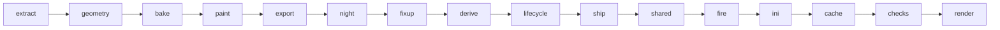

# The art engine: a map

`sagekit` builds new building art for BFME2 / RotWK from the player's own install. `assets/`
holds only recipes (Python classes and notes); everything built goes to `build/assets/`, which git
ignores. This page is the map: what exists, where it lives, how the pieces connect and where each
faction stands. The rules and each standard in detail: [assets/README.md](../assets/README.md).
What comes next: [FACTIONS-PLAN.md](FACTIONS-PLAN.md).

## Where each faction stands

| Faction | Recipes | State |
|---|---|---|
| Dwarves | 35 | Installed; every model the game draws carries the redesign: healthy, construction, damaged, really damaged, rubble, placement cursor, night. Not yet checked in game. |
| Elves | 23 | Installed. Not yet checked in game. [`assets/elves/ROLLOUT.md`](../assets/elves/ROLLOUT.md). |
| Men of the West (and Arnor) | 44 | Installed: citadel, upgrades, expansions, walls, production with level-ups, towers and specials. Not yet checked in game. [`assets/men/ROLLOUT.md`](../assets/men/ROLLOUT.md). |
| Goblins | 14 | Installed: palette E "Blood, iron and bone", every building. Not yet checked in game. [`assets/goblins/ROLLOUT.md`](../assets/goblins/ROLLOUT.md). |
| Isengard | 25 | Measured stubs; palette A with silver (Max's pick); the citadel built in colour (three lozenge blades round EA's tower, fire and embers, war-works on the walks); nothing installed. [`assets/isengard/ROLLOUT.md`](../assets/isengard/ROLLOUT.md). |
| Mordor | 25 | Palette F2 (Max's pick); the citadel in pass 7 (spike claws inside the crowns round green witch-fire), built in colour, not installed. [`assets/mordor/ROLLOUT.md`](../assets/mordor/ROLLOUT.md). |
| Angmar | 0 | Surveyed; plan in [FACTIONS-PLAN.md](FACTIONS-PLAN.md). |

Budget: 512 MB of own textures per faction (`budget_mb` in `sagekit/style.py`; `sagekit budget`).
An installed faction adds `!!!!!!!!!!!sagekit-<faction>.big` with edited INIs to the game folder,
so everyone in a LAN game needs the same packs ([MULTIPLAYER.md](../MULTIPLAYER.md)).

## One building, step by step

`python3 -m sagekit build <faction>/<building>` runs these steps (`sagekit/pipeline.py`). Host
steps are plain Python; Blender steps run through `sagekit/blender/run.py`, at most
`SAGEKIT_BLENDER_SLOTS` (4) at once, and wait while the game runs.



| Step | Where | What it does |
|---|---|---|
| extract | host | EA's model, sheets and skeleton from the pristine archives; own copy renamed; `measure.json`; derived and lifecycle plans |
| geometry | Blender | the recipe's `design(kit)` solids added to EA's target mesh; cloth faces out to the house step; own UV layout |
| bake | Blender | G-buffers (position, normal, AO, masks, alpha) into our layout |
| paint | host (numpy) | the style's paint stack writes our diffuse, normal map and state variants (`_D`, `_Snow`, `_U`) |
| export | Blender | W3D export (the add-on drops things; fixup restores them) |
| night | Blender | the recipe's `night_lights` cast onto our finished body |
| fixup | host | materials, versions, pivots, collision trees restored; night meshes written under EA's names |
| derive | host | lifecycle models whose body is EA's healthy one get ours spliced in whole |
| lifecycle | Blender | the rest (construction, really damaged, rubble) rebuilt along EA's pieces, bones and animations |
| ship | host | exactly what goes into the game, at archive paths, in `out/` |
| shared | host | faction copies of other factions' sheets renamed, recoloured and shipped |
| fire | host | the recipe's `fire_points` as bones of a meshless rig model, `<model>_FX.w3d` |
| ini | host | texture swaps, repointed Draws, LOD off, house draws, hidden banners, fire Draws |
| cache | host | asset.dat records for every new or changed model and texture |
| checks | Blender | the check suite against EA's original: format, bones, footprint, height, UVs, sky-facing backs, alpha, night, lifecycle |
| render | Blender | `renders/compare_*.png` (EA against ours), `night/`, `lifecycle/` |
| *preview* | Blender | not a build step: `sagekit preview` runs extract (once), the geometry job into `preview/`, EEVEE renders in flat atlas-tag colours (`preview/compare_*.png`) and the bake-free checks (budget, footprint, height, winding, sky-facing backs, closed solids) in 10-20 s, for design iterations |

Faction-wide steps: `sagekit sheets <faction>` recolours the faction's own sheets (models we don't
redesign still match); `sagekit house <faction>` builds the player-colour models from every
building's cloth; `sagekit install` / `revert` put everything in the game and take it out.

## The standards every faction inherits

| Standard | Recipe says | Faction style says | Engine (under `sagekit/`) |
|---|---|---|---|
| One palette | nothing | ramps, materials, paint stack | `style.py`, `paint/` |
| Player colour | `house_tags` (which atlas tags are cloth) | `house_template` | `house.py`, `housemesh.py`, `blender/house.py` |
| Night lights | `night_lights(kit)` | `night = NightLook(...)` | `nightlights.py`, `blender/nightlights.py`, `paint/night.py`, `formats/w3dlight.py` |
| Fire | `fire_points = [(x, y, z, kind)]` | nothing | `fire.py`, `fire_systems.py`, `fire_checks.py` |
| Lifecycle | `lifecycle = {model: settings}` (rarely) | nothing | `lifecycle.py`, `blender/lifecycle*.py`, `formats/w3dpose.py`, `w3dmesh.py` |
| Own copies | `own_model`, `own_textures` | `shared_sheets` | `owncopy.py`, `sharedsheets.py`, `ownership.py` |
| Names | nothing | nothing | `names.py` (`assets/<faction>/NAMES.md`), `validate` |
| Cut-out alpha | nothing | nothing | `alpha.py`, `blender/alpha.py` |

## Fire: the game's own particles

Painted flames read as plastic; the game's particle systems flicker, glow additively and read at
night. What EA's files and RotWK's `game.dat` show:

- `ParticleSysBone = <bone> <system> [FollowBone:Yes]` (the `=` is optional) in a
  ModelConditionState starts `<system>` at `<bone>` of that state's own model. There is no offset:
  the bone must be a pivot of the Draw's model. A bone the model lacks, `NONE`, or a state whose
  Model is None puts the system at the object's origin (EA's rubble smoke uses `NONE` on purpose).
  Pivot names hold 15 characters: EA's hearth names `dwarfHearth_SPARKS`, its model has
  `DWARFHEARTH_SPA`, so those sparks start at the origin.
- Every ModelConditionState starts as a copy of the Draw's DefaultModelConditionState, particle
  lines included (`game.dat` 0x4c8133; EA's comment in `neutralunits.ini`: "Not
  DefaultConditionState, because that keyword copies anything in here to every other state").
  EA's working forges put their fire in the default and keep the bones in every state's model
  (the Men forge's rubble still has `CHIMNEY`, `EMBERBONE`); the Isengard siege works' construction
  and damaged models carry `BN_FIRE05/06`, its really damaged and rubble ones do not.
- Damage fire is per state on bones of the state's model (`FIRESMALL01..05` in `_D1`/`_D2`,
  `SMOKELARGE01` in `_D3`); effects that must not spread use a Draw of their own with no default
  and `ModelConditionState = NONE` first (the Dwarven hearth's and statue's `TheHealEffect`).

So sagekit's fire never touches EA's Draws, models or animations (their hierarchy stays byte for
byte, animations keep their pivot indices). A recipe's `fire_points` become one rig per building,
`<model>_FX.w3d`: a model without meshes in EA's OBBFoundationX form (hierarchy with a root and
`FIRE01`.., one collision-free box, HLOD), filed in asset.dat as a copy of OBBFoundationX's
record. Each Draw the recipe covers gets a Draw of ours after it: EA's states mirrored in EA's
order, NONE first, so the engine picks the matching state in both; the rig and its lines where
the state shows our intact body (healthy, damaged, snow, stonework), Model None elsewhere (really
damaged, rubble, building site, placement ghost, where EA's own damage fire takes over). Kinds and
EA's systems (in `fxparticlesystem.ini` or `particlesystem.ini`, the two the game loads, each on one of EA's own
buildings or props):

| Kind | Systems | EA's use |
|---|---|---|
| chimney | SiegeWorkFire, SmokeChimney | Isengard siege works, Isengard tavern |
| furnace | furnaceFire, furnaceSparks | civilian furnace, Isengard camp |
| forge | ForgeCoal, ForgeEmbers | Men forge |
| hearth | furnaceFire, CampfireEmbersSmall | furnace, campfire props |
| crucible | ForgeCoal, furnaceSparks | forge, furnace |
| brazier | FireTorch, TorchSmokeBlack | Isengard tavern torches |
| grate | ForgeCoal, CampfireEmbersSmall | forge, campfire props |
| embers | CampfireEmbersSmall | campfire props |
| pyre | FireBuildingLarge, SmokeBuildingLarge | every burning structure's big fire and heavy dark plume |
| smoke | SmokeChimney | Isengard and Mordor taverns' chimneys (a thin dark column, no fire) |
| plume | SmokeBuildingLarge | the heavy dark plume alone (the Mordor forge's flue) |
| witchfire | SagekitWitchFire, SagekitWitchSmoke | ours: furnaceFire in Morgul green, a modest dark plume (the Mordor crowns) |
| witchflame | SagekitWitchFire | ours: the green fire alone |

EA burns no green fire in place (its green systems are spells, hits and trails), so a kind may
draw systems of our own (`sagekit/fire_systems.py`): a copy of one of EA's FXParticleSystems, made
at build time from the player's own `fxparticlesystem.ini` (no EA text in git), renamed `Sagekit*`,
a few fields and the Color keyframes changed (`EXFire01.tga` is grey: the keyframes alone make
EA's fire orange). The game reads FX systems from `Data\INI\FXParticleSystem.ini` only
(`SubsystemLegend*.ini` comments out `FXParticleSystemCustom.ini`), before the objects, so the
ini step inserts each block into that file after the EA block it copies (the 2.02 patch's note at
the end asks for nothing to be added there). A building drawing any of them ships the whole set,
so every faction archive's copy of the file is the same. The checks hold the file to EA's plus
exactly our blocks, each defined once, no name EA's. New kinds are appended; the existing ones
never change (installed buildings use them).

The checks hold the rig's bones to the points, its record to the file, each fire Draw to EA's
states (fire only where our body stands) and the rest of the INI to the other edits, and every
system to the game's INIs; `renders/fire/compare_<view>.png` marks the points over the render
(Blender cannot draw the particles). A `base` recipe shown per upgrade level declares none.

## Where the code is

| Area | Modules (under `sagekit/`) |
|---|---|
| Commands | `__main__.py`: list, validate, inventory, budget, build, preview (`preview.py`, `blender/preview.py`), sheets, house, names, owners, new, measure, board (`board.py`, `blender/board.py`), palettes (`palettes.py`, `paint/palette.py`), install, revert |
| A building | `building.py` (the recipe base class), `style.py`, `atlas.py`, `taxonomy.py`, `registry.py`, `workspace.py`, `paths.py` |
| The game | `game.py` (archives in load order), `formats/big.py`, `formats/assetcache.py`, `formats/ini.py`, `ownership.py` |
| Models | `formats/w3d.py` (read, fix the exporter's losses), `w3dframes.py`, `w3dpose.py`, `w3dmesh.py`, `w3dcopy.py`, `w3dlight.py` |
| Textures | `formats/textures.py` (headers), `paint/imageio.py` (pixels; 24- and 32-bit TGA) |
| Design | `assets/<faction>/shapes.py` (the kit), `blender/geometry.py` (closed solids), `blender/layout.py`, `blender/mapping.py` |
| Paint | `paint/canvas.py`, `layers.py`, `masks.py`, `fields.py`, `painter.py`, `sheets.py`, `night.py` |
| Blender plumbing | `blender/run.py`, `jobs.py`, `scene.py`, `bake.py`, `render.py` |
| Checks | `blender/checks.py`, `checks_suite.py`, `checks_lifecycle.py`, `alpha.py`, `nightlights.py` |
| New factions | `scaffold.py` + `scaffold_write.py` (`sagekit new`), `measure.py` + `blender/measure.py` (`sagekit measure`) |
| Player colour, install | `house.py`, `housemesh.py`, `blender/house.py`, `install.py` |
| Units (builders) | `units/` (recipe, mesh, build, paint, render, install, records, cli), `blender/unit_pose.py`: [UNITS.md](UNITS.md) |

## A faction's folder

```
assets/<faction>/
    style.py      palette, paint stack, house template, night look, shared sheets
    atlas.py      regions and mask hints on the faction's master sheet
    shapes.py     the faction's kit (Dwarves: stepped, blocky; Elves: pointed, slender)
    NAMES.md      generated: every shipped model and texture name
    <building>/   building.py (the recipe) and README.md (what changed, status, decisions)
build/assets/<faction>/<building>/
    src/ work/ out/ renders/      EA's sources, intermediates and logs, what ships, the previews
    preview/                      `sagekit preview`: its geometry scene, compare_<view>.png, checks.txt
```

## Things the engine knows so recipes don't have to

- asset.dat files every model and texture: a texture without a record renders magenta, a model
  with a stale record or no record renders invisible; models of our own name get a copy of EA's
  record (`AssetCache.add_model`; the own copies were invisible in game on 2026-09-28 without one).
- Blender's W3D exporter drops materials, collision trees, versions and pivots; fixup restores them.
- W3D texture v runs up from the image's bottom row; the game's normal maps have red inverted
  against Blender's; 82 of EA's normal maps are 32-bit.
- A few of EA's sheets exist only as TGA, not DDS (among building sheets, the Isengard tavern's
  `ibwildbuilding` family): the extract step reads a sheet's DDS, else its TGA
  (`formats/textures.py` `sheet_member`), keeps a DDS copy in `src/` (`tga_to_dds`), and a
  state swap to a TGA-only sheet (the tavern's snow) is a variant like any other. Sheets with a
  DDS read exactly as before (checked 2026-09-29: every other recipe's members and variants unchanged).
  `sagekit sheets` recolours a TGA-only sheet some model draws and writes it back as TGA at EA's
  path, size and bit depth (the faction's archive loads first); a TGA-only image no model draws
  (a button) is left alone. No other faction's folder has a TGA-only sheet.
- EA's folders mix factions (`art\compiledtextures\eb` holds Elven and Erebor sheets); the
  ownership map decides, not the folder.
- A variant sheet is reached only by name: a damaged model's meshes, a state's `Texture =` swap, or
  a Draw's `WeatherTexture = SNOWY` (the bibs'; read by the ownership scan since 2026-09-30, which
  showed three factions' lumber mills drawing `MBLumberMill_Bib_snow`). `sagekit sheets` judges
  each variant on who draws it.
- House-colour meshes are found by their texture, not only an `HC_` name.
- An add-on's cloth (`parts` shown under an upgrade flag) goes to a house model of its own whose
  Draw mirrors the add-on's states (`Building.addon_conditions`), never to the object's house
  model, which is drawn before the upgrade too (the anvil's banner hung in the air).
- A derived body keeps no EA sheet: a state drawn with a normal map of its own (the Elven
  barracks' `NBElvnBarx_D_NRM`) gets a copy of ours under a name of the same length.
- A faction's objects are those of `Style.ini_dirs()`: `ini_dir` (a folder, a file or a list)
  plus the structure folder of each group that reuses its models one for one (`ownership.FOLLOWS`:
  Arnor for the Men), so swaps, own-model repoints, house draws and hidden banners reach Arnor too.
- A ChildObject draws the Draw modules it inherits from a parent defined elsewhere
  (`Install.object_draws`: GondorFarm draws FarmInterface's, in `farminterface.ini`); edits to
  them go to the parent's file.
- One Draw module may show two bodies under `BUILD_VARIATION_ONE` / `_TWO` (the Men's fortress
  expansions). Each is a recipe of its own that owns only its variation's states
  (`Building.own_states`): derived and lifecycle models, variants, repoints and ownership follow
  it, and a house model of our own is drawn in its variation only.
- A model without meshes (`OBBFoundationX`, the foundations' stand-in) is nobody's art: it never
  needs an own copy and is never rebuilt.
- Some construction models are a remodel of EA's healthy body, not a cut of it (the Goblin cave,
  trove, lumber mill and giant sentry: faces offset, the underground part trimmed, a narrower
  footprint). Cut along them, our body lost faces and was judged against EA's remodel, so the step
  left EA's model in place (the Goblins showed EA's art while building, 2026-09-29). A recipe's
  `lifecycle = {"<model>": {"fill": True}}` rides every face of ours on its nearest piece and holds
  what stands where our healthy body stands to that body.

## Known limits

- Night lights exist only where EA's model has night meshes; lanterns elsewhere stay dark.
- Fire is checked in files and marker renders only; how it reads (size, smoke, cost of many
  systems on one building) is checked in game.
- A few Elven lifecycle states stay EA's where our design fails the sky check (listed in each
  recipe's `work/lifecycle.json` and README).
- The lifecycle choice uses open backs as its only quality signal; thin shards need a human look.
- Renders approximate the game's lighting; the in-game look is checked in play.
- Open bug (2026-09-28): own-copy models (the Men citadel, the Elven barracks and mallorn) render
  invisible in game.
