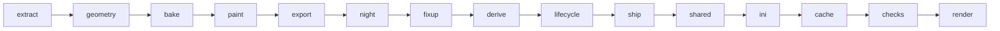

# The art engine: a map

`sagekit` builds new building art for BFME2 / RotWK from the player's own install. `assets/`
holds only recipes (Python classes and notes); everything built goes to `build/assets/`, which git
ignores. This page is the map: what exists, where it lives, how the pieces connect and where each
faction stands. The rules and each standard in detail: [assets/README.md](../assets/README.md).
What comes next: [FACTIONS-PLAN.md](FACTIONS-PLAN.md).

## Where each faction stands (2026-09-26)

| Faction | Recipes | State |
|---|---|---|
| Dwarves | 35 | Installed; every model the game draws carries the redesign: healthy, construction, damaged, really damaged, rubble, placement cursor, night. Reinstalled 2026-09-27 with the monument's banners shown only with its upgrade. Max's in-game check pending. |
| Elves | 23 | Installed (2026-09-26; reinstalled 2026-09-27 with the anvil banner shown only with its upgrade). [`assets/elves/ROLLOUT.md`](../assets/elves/ROLLOUT.md). |
| Men of the West (and Arnor) | 44 | Installed 2026-09-27: citadel, upgrades, expansions, walls, production with level-ups, towers and specials; every build ALL PASS. Poster `build/assets/men/men_poster.jpg`; [`assets/men/ROLLOUT.md`](../assets/men/ROLLOUT.md). Max's in-game check pending. |
| Men | 31 stubs | Measured stubs, citadel pilot in progress; framework pass done 2026-09-27. Plan: [`assets/men/ROLLOUT.md`](../assets/men/ROLLOUT.md). |
| Isengard, Mordor, Goblins, Angmar | 0 | Surveyed; plan in FACTIONS-PLAN.md. |

## One building, step by step

`python3 -m sagekit build <faction>/<building>` runs these steps (`sagekit/pipeline.py`). Host
steps are plain Python; Blender steps run through `sagekit/blender/run.py`, at most
`SAGEKIT_BLENDER_SLOTS` (4) at once, and wait while the game runs.



| Step | Where | What it does |
|---|---|---|
| extract | host | EA's model, sheets and skeleton from the pristine archives; own copy renamed; `measure.json`; derived and lifecycle plans |
| geometry | Blender | the recipe's `design(kit)` solids added to EA's target mesh; cloth faces out to the house step; own UV layout |
| bake | Blender | G-buffers (position, normal, AO, masks, alpha) into our layout |
| paint | host (numpy) | the style's paint stack writes our diffuse, normal map and state variants (`_D`, `_Snow`, `_U`) |
| export | Blender | W3D export (the add-on drops things; fixup restores them) |
| night | Blender | the recipe's `night_lights` cast onto our finished body |
| fixup | host | materials, versions, pivots, collision trees restored; night meshes written under EA's names |
| derive | host | lifecycle models whose body is EA's healthy one get ours spliced in whole |
| lifecycle | Blender | the rest (construction, really damaged, rubble) rebuilt along EA's pieces, bones and animations |
| ship | host | exactly what goes into the game, at archive paths, in `out/` |
| shared | host | faction copies of other factions' sheets renamed, recoloured and shipped |
| ini | host | texture swaps, repointed Draws, LOD off, house draws, hidden banners |
| cache | host | asset.dat records for every new or changed model and texture |
| checks | Blender | the check suite against EA's original: format, bones, footprint, height, UVs, sky-facing backs, alpha, night, lifecycle |
| render | Blender | `renders/compare_*.png` (EA against ours), `night/`, `lifecycle/` |

Faction-wide steps: `sagekit sheets <faction>` recolours the faction's own sheets (models we don't
redesign still match); `sagekit house <faction>` builds the player-colour models from every
building's cloth; `sagekit install` / `revert` put everything in the game and take it out.

## The standards every faction inherits

| Standard | Recipe says | Faction style says | Engine |
|---|---|---|---|
| One palette | nothing | ramps, materials, paint stack | `style.py`, `paint/` |
| Player colour | `house_tags` (which atlas tags are cloth) | `house_template` | `house.py`, `housemesh.py`, `blender/house.py` |
| Night lights | `night_lights(kit)` | `night = NightLook(...)` | `nightlights.py`, `blender/nightlights.py`, `paint/night.py`, `formats/w3dlight.py` |
| Lifecycle | `lifecycle = {model: settings}` (rarely) | nothing | `lifecycle.py`, `blender/lifecycle*.py`, `formats/w3dpose.py`, `w3dmesh.py` |
| Own copies | `own_model`, `own_textures` | `shared_sheets` | `owncopy.py`, `sharedsheets.py`, `ownership.py` |
| Names | nothing | nothing | `names.py` (`assets/<faction>/NAMES.md`), `validate` |
| Cut-out alpha | nothing | nothing | `alpha.py`, `blender/alpha.py` |

## Where the code is

| Area | Modules |
|---|---|
| Commands | `__main__.py`: list, validate, inventory, budget, build, sheets, house, names, owners, new, measure, install, revert |
| A building | `building.py` (the recipe base class), `style.py`, `atlas.py`, `taxonomy.py`, `registry.py`, `workspace.py`, `paths.py` |
| The game | `game.py` (archives in load order), `formats/big.py`, `formats/assetcache.py`, `formats/ini.py`, `ownership.py` |
| Models | `formats/w3d.py` (read, fix the exporter's losses), `w3dframes.py`, `w3dpose.py`, `w3dmesh.py`, `w3dcopy.py`, `w3dlight.py` |
| Textures | `formats/textures.py` (headers), `paint/imageio.py` (pixels; 24- and 32-bit TGA) |
| Design | `assets/<faction>/shapes.py` (the kit), `blender/geometry.py` (closed solids), `blender/layout.py`, `blender/mapping.py` |
| Paint | `paint/canvas.py`, `layers.py`, `masks.py`, `fields.py`, `painter.py`, `sheets.py`, `night.py` |
| Blender plumbing | `blender/run.py`, `jobs.py`, `scene.py`, `bake.py`, `render.py` |
| Checks | `blender/checks.py`, `checks_suite.py`, `checks_lifecycle.py`, `alpha.py`, `nightlights.py` |
| New factions | `scaffold.py` + `scaffold_write.py` (`sagekit new`), `measure.py` + `blender/measure.py` (`sagekit measure`) |
| Player colour, install | `house.py`, `housemesh.py`, `blender/house.py`, `install.py` |

## A faction's folder

```
assets/<faction>/
    style.py      palette, paint stack, house template, night look, shared sheets
    atlas.py      regions and mask hints on the faction's master sheet
    shapes.py     the faction's kit (Dwarves: stepped, blocky; Elves: pointed, slender)
    NAMES.md      generated: every shipped model and texture name
    <building>/   building.py (the recipe) and README.md (what changed, status, decisions)
build/assets/<faction>/<building>/
    src/ work/ out/ renders/      EA's sources, intermediates and logs, what ships, the previews
```

## Things the engine knows so recipes don't have to

- asset.dat files every model and texture: a texture without a record renders magenta, a model
  with a stale record renders invisible; models of our own are parsed directly.
- Blender's W3D exporter drops materials, collision trees, versions and pivots; fixup restores them.
- W3D texture v runs up from the image's bottom row; the game's normal maps have red inverted
  against Blender's; 82 of EA's normal maps are 32-bit.
- EA's folders mix factions (`art\compiledtextures\eb` holds Elven and Erebor sheets); the
  ownership map decides, not the folder.
- House-colour meshes are found by their texture, not only an `HC_` name.
- An add-on's cloth (`parts` shown under an upgrade flag) goes to a house model of its own whose
  Draw mirrors the add-on's states (`Building.addon_conditions`), never to the object's house
  model, which is drawn before the upgrade too (the anvil's banner hung in the air).
- A derived body keeps no EA sheet: a state drawn with a normal map of its own (the Elven
  barracks' `NBElvnBarx_D_NRM`) gets a copy of ours under a name of the same length.
- A faction's objects are those of `Style.ini_dirs()`: `ini_dir` (a folder, a file or a list)
  plus the structure folder of each group that reuses its models one for one (`ownership.FOLLOWS`:
  Arnor for the Men), so swaps, own-model repoints, house draws and hidden banners reach Arnor too.
- A ChildObject draws the Draw modules it inherits from a parent defined elsewhere
  (`Install.object_draws`: GondorFarm draws FarmInterface's, in `farminterface.ini`); edits to
  them go to the parent's file.
- One Draw module may show two bodies under `BUILD_VARIATION_ONE` / `_TWO` (the Men's fortress
  expansions). Each is a recipe of its own that owns only its variation's states
  (`Building.own_states`): derived and lifecycle models, variants, repoints and ownership follow
  it, and a house model of our own is drawn in its variation only.
- A model without meshes (`OBBFoundationX`, the foundations' stand-in) is nobody's art: it never
  needs an own copy and is never rebuilt.

## Known limits

- Night lights exist only where EA's model has night meshes; lanterns elsewhere stay dark.
- A few Elven lifecycle states stay EA's where our design fails the sky check (listed in each
  recipe's `work/lifecycle.json` and README).
- The lifecycle choice uses open backs as its only quality signal; thin shards need a human look.
- Renders approximate the game's lighting; the in-game look is Max's call.
